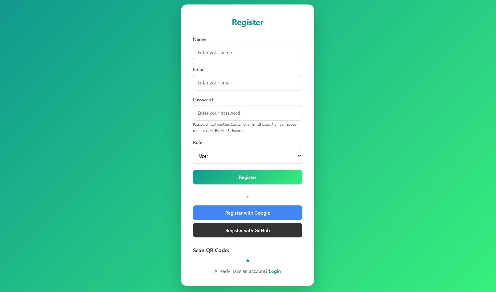

#  Full Secure Authentication System

A secure authentication and document management system with role-based access control, multi-factor authentication, file encryption, and digital signatures.

## ✨ Features

### 🔑 Authentication
- **Email/Password Registration** with password validation
  - Minimum 8 characters
  - Capital & small letters
  - Numbers
  - Special characters (* / @)
- **Social Login**: Google & GitHub OAuth
- **Two-Factor Authentication (2FA)** using Google Authenticator
- **JWT-based Session Management**

### 👥 Role-Based Access Control (RBAC)
Role-Based Access Control (RBAC)

The system implements role-based access control to manage user permissions securely.

User
Upload documents
Download personal documents
Delete personal documents
Verify document integrity
Manager
View all uploaded documents
Delete documents
Verify document integrity
Admin
Full access to all documents
Download and delete any document
Verify document integrity
Manage users and permissions

### 📁 Secure Document Management
- **File Upload**: PDF, DOCX, PPT, PPTX (max 5MB)
- **AES-256 Encryption**: Files are encrypted before storage
- **SHA-256 Hash**: Document integrity verification
- **RSA Digital Signature**: Document authentication

### 🌐 Security
- **HTTPS Support** with SSL/TLS
- **Encrypted File Storage**
- **Password Hashing** with bcrypt
- **Session Management**

## 🚀 Getting Started

### Prerequisites
- Node.js v18+
- MySQL
- npm or yarn

### Installation

```bash
# Clone the repository
cd backend

# Install dependencies
npm install

# Configure environment
cp .env.example .env
# Edit .env with your settings
```

### Environment Variables

```env
JWT_SECRET=your-jwt-secret
ENCRYPTION_KEY=your-32-char-key

# Google OAuth (Optional)
GOOGLE_CLIENT_ID=your-google-client-id
GOOGLE_CLIENT_SECRET=your-google-client-secret

# GitHub OAuth (Optional)
GITHUB_CLIENT_ID=your-github-client-id
GITHUB_CLIENT_SECRET=your-github-client-secret
```

### Generate SSL Certificates

```bash
node generate-ssl.js
```

### Database Setup

```sql
CREATE TABLE users (
  id INT AUTO_INCREMENT PRIMARY KEY,
  name VARCHAR(100),
  email VARCHAR(100) UNIQUE,
  password VARCHAR(255),
  role ENUM('admin', 'manager', 'user'),
  twofa_secret VARCHAR(255)
);

CREATE TABLE documents (
  id INT AUTO_INCREMENT PRIMARY KEY,
  user_id INT,
  original_name VARCHAR(255),
  encrypted_name VARCHAR(255),
  hash_value TEXT,
  signature_value TEXT,
  uploaded_at TIMESTAMP DEFAULT CURRENT_TIMESTAMP,
  FOREIGN KEY (user_id) REFERENCES users(id)
);
```

### Run the Server

```bash
# HTTP Server (port 3000)
node app.js

# HTTPS Server (port 3001)
# Requires SSL certificates
node app.js
```

## 📁 Project Structure

```
├── backend/
│   ├── config/
│   │   ├── db.js           # Database connection
│   │   └── passport.js      # OAuth configuration
│   ├── controllers/
│   │   ├── authController.js
│   │   └── documentController.js
│   ├── middleware/
│   │   ├── authMiddleware.js
│   │   └── roleMiddleware.js
│   ├── routes/
│   │   ├── authRoutes.js
│   │   └── documentRoutes.js
│   ├── utils/
│   │   ├── encryption.js   # AES-256
│   │   ├── hash.js          # SHA-256
│   │   └── signature.js     # RSA
│   ├── keys/                 # SSL certificates
│   ├── uploads/              # Encrypted files
│   ├── app.js
│   └── generate-ssl.js
├── frontend/
│   ├── js/
│   ├── css/
│   └── *.html
└── README.md
```

## 🔒 Security Flow

### Document Upload
```
User Upload → Multer → AES-256 Encrypt → SHA-256 Hash → RSA Sign → Database
```

### Document Download
```
Request → Auth Check → RSA Verify → SHA-256 Verify → AES-256 Decrypt → User
```

### 2FA Verification
```
Login → Email/Password → Google Authenticator Code → JWT Token
```

## 🌐 API Endpoints

### Auth
- `POST /api/auth/register` - Register with email
- `POST /api/auth/login` - Login
- `POST /api/auth/verify-2fa` - Verify 2FA code
- `GET /api/auth/google` - Google OAuth
- `GET /api/auth/github` - GitHub OAuth

### Documents
- `POST /api/documents/upload` - Upload & encrypt
- `GET /api/documents` - List documents
- `GET /api/documents/download/:id` - Download & decrypt
- `DELETE /api/documents/:id` - Delete document
- `GET /api/documents/verify/:id` - Verify document integrity

## 📖 Usage

1. **Register**: Create account with valid email & password
2. **Scan QR**: Setup Google Authenticator
3. **Login**: Enter credentials + 2FA code
4. **Upload**: Add documents (auto-encrypted)
5. **Verify**: Check document integrity & signature
6. **Download**: Retrieve decrypted files

## ⚠️ Demo Notes

For Wireshark MITM Demo:

| Protocol | Port | Visible Data |
|----------|------|--------------|
| HTTP | 3000 | Plain text (password visible) |
| HTTPS | 3001 | Encrypted (secure) |

## 📝 License

MIT License

## 👨‍💻 Author

Created for Data Integrity and Authentication course project.